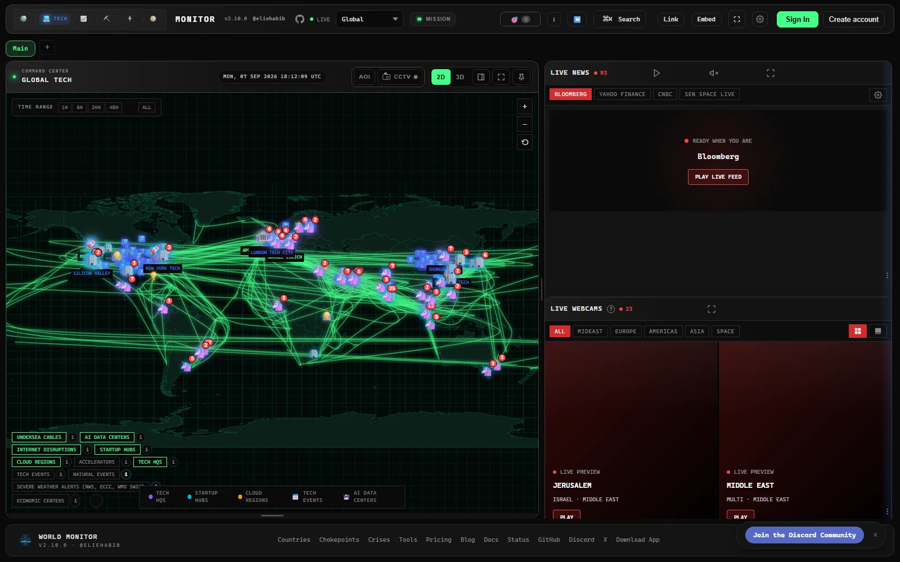

<p align="center">
  
</p>

<h1 align="center">World Monitor</h1>

<p align="center">
  <strong>A real-time command center for global intelligence.</strong><br>
  Turn live geopolitical, military, infrastructure, climate, aviation, maritime, and market signals into one coherent operational picture.
</p>

<p align="center">
  <a href="https://www.worldmonitor.app"></a>
  <a href="SELF_HOSTING.md"></a>
  <a href="https://www.worldmonitor.app/docs/documentation"></a>
</p>

<p align="center">
  
  
  
  
  <a href="https://www.gnu.org/licenses/agpl-3.0"></a>
  <a href="https://discord.gg/re63kWKxaz"></a>
</p>

<p align="center">
  <a href="#interface-showcase"><strong>Showcase</strong></a> ·
  <a href="#what-it-does"><strong>Capabilities</strong></a> ·
  <a href="#quick-start"><strong>Quick start</strong></a> ·
  <a href="#programmatic-access"><strong>API & SDKs</strong></a> ·
  <a href="SELF_HOSTING.md"><strong>Self-hosting</strong></a><br>
  <a href="README.zh-CN.md">简体中文</a> · <a href="README.ja-JP.md">日本語</a>
</p>

> [!TIP]
> The complete local stack runs with Docker and Redis. Background collectors refresh the cache on a schedule, so opening the dashboard does not fan out to dozens of upstream services.

## Interface Showcase

<table>
  <tr>
    <td width="50%" valign="top">
      
      <br><sub><strong>Global Command Center</strong> — a unified view of live events, conflict zones, critical infrastructure, news, and public cameras.</sub>
    </td>
    <td width="50%" valign="top">
      
      <br><sub><strong>Technology Intelligence</strong> — startup hubs, cloud regions, subsea cables, outages, and strategic technology signals.</sub>
    </td>
  </tr>
  <tr>
    <td width="50%" valign="top">
      
      <br><sub><strong>Supply-Chain Visibility</strong> — maritime corridors, transport flows, chokepoints, and infrastructure exposure on one operational map.</sub>
    </td>
    <td width="50%" valign="top">
      
      <br><sub><strong>Immersive 3D Globe</strong> — global maritime and geospatial activity rendered in a focused, high-context view.</sub>
    </td>
  </tr>
</table>

---

## What It Does

- **Curated news feeds** across global and regional categories, AI-synthesized into briefs
- **Dual map engine** — 3D globe (globe.gl) and WebGL flat map (deck.gl) with a shared map-layer catalog
- **Panel inventory** — concrete panel implementations across specialized variants
- **Cross-stream correlation** — military, economic, disaster, and escalation signal convergence
- **Country Instability Index (CII)** — server-authoritative CII v8 stress scoring for the Tier-1 registry
- **Finance radar** — stock exchanges, commodities, crypto, and a market composite
- **Local AI** — run everything with Ollama, no API keys required
- **Site variants** from a single codebase (world, tech, finance, commodity, happy, energy)
- **Native desktop app** (Tauri 2) for macOS, Windows, and Linux
- **Multilingual UI** with native-language feeds and RTL support

For the full feature list, architecture, data sources, and algorithms, see the **[documentation](https://www.worldmonitor.app/docs/documentation)**.

---

## Support Status

All site variants and desktop binaries are built from a single codebase and ship from the same release process. The table below clarifies maintenance status so you know which surfaces are safe to depend on.

| Surface | Status | Notes |
|---------|--------|-------|
| `worldmonitor.app`, `tech.`, `finance.`, `commodity.`, `happy.`, `energy.` | Stable | Public deployments built from this repo, actively maintained |
| Desktop binaries (Windows / macOS Apple Silicon / macOS Intel / Linux AppImage) | Stable | One Tauri binary for every variant — install World Monitor and switch to tech, finance, commodity, energy, or happy in-app. There is deliberately no per-variant download |

Issues filed against any of the above are triaged from the same backlog — see the [issues board](https://github.com/koala73/worldmonitor/issues) for currently-open work.

---

## Quick Start

### Fast development mode

```bash
git clone https://github.com/detinatran/dashboard.git
cd dashboard
npm install
npm run dev
```

Open [localhost:3000](http://localhost:3000) (override the port with `DEV_PORT` in `.env.local`). The app runs with no environment variables.

Feature-specific data sources may require credentials. See `.env.example` for the full list.

### Complete self-hosted stack

For the production-style setup used by this repository — frontend, API handlers, Redis cache, AIS relay, and scheduled data collectors — follow the [Docker self-hosting guide](SELF_HOSTING.md). It includes secure secret generation, cache seeding, health checks, and optional provider keys.

For variant-specific development:

```bash
npm run dev:tech       # tech.worldmonitor.app
npm run dev:finance    # finance.worldmonitor.app
npm run dev:commodity  # commodity.worldmonitor.app
npm run dev:happy      # happy.worldmonitor.app
npm run dev:energy     # energy.worldmonitor.app
```

See the **[self-hosting guide](https://www.worldmonitor.app/docs/getting-started)** for deployment options (Vercel, Docker, static).

---

## Tech Stack

| Category | Technologies |
|----------|-------------|
| **Frontend** | Vanilla TypeScript, Vite, globe.gl + Three.js, deck.gl + MapLibre GL |
| **Desktop** | Tauri 2 (Rust) with Node.js sidecar |
| **AI/ML** | Ollama / Groq / OpenRouter, Transformers.js (browser-side) |
| **API Contracts** | Protocol Buffers and sebuf HTTP annotations |
| **Deployment** | Vercel Edge Functions, Railway relay, Tauri, PWA |
| **Caching** | Redis (Upstash), 3-tier cache, CDN, service worker |

Full stack details in the **[architecture docs](https://www.worldmonitor.app/docs/architecture)**.

---

## Programmatic Access

World Monitor is built for agents and scripts as well as browsers:

- **MCP server** — `https://worldmonitor.app/mcp` (Streamable HTTP). Public `tools/list`; `tools/call` authenticates with a `X-WorldMonitor-Key` header or OAuth.
  The server also publishes its Agent Skills through the draft `io.modelcontextprotocol/skills` extension (`skills/list`, `skills/get`, and `skill://…` resource reads).
- **REST API** — base `https://api.worldmonitor.app`, described by the [OpenAPI spec](https://worldmonitor.app/openapi.yaml).
- **CLI** — the official [`worldmonitor`](https://www.npmjs.com/package/worldmonitor) npm package (source in [`cli/`](cli/)):

  ```sh
  npx worldmonitor tools          # run ad-hoc — list every MCP tool (no key needed)
  npm install -g worldmonitor     # or install the `worldmonitor` (alias `wm`) command
  worldmonitor risk IR --api-key wm_xxx
  ```

- **SDKs** — official zero-dependency client libraries mirroring the CLI: Python [`worldmonitor-sdk`](https://pypi.org/project/worldmonitor-sdk/) (source in [`sdk/python/`](sdk/python/)), Ruby [`worldmonitor`](https://rubygems.org/gems/worldmonitor) ([`sdk/ruby/`](sdk/ruby/)), Go [`github.com/koala73/worldmonitor/sdk/go`](https://pkg.go.dev/github.com/koala73/worldmonitor/sdk/go) ([`sdk/go/`](sdk/go/)). Guide: [worldmonitor.app/docs/sdks](https://www.worldmonitor.app/docs/sdks).

Agent discovery files: [`llms.txt`](https://worldmonitor.app/llms.txt) · [agent-skills manifest](https://worldmonitor.app/.well-known/agent-skills/index.json) · [api-catalog](https://worldmonitor.app/.well-known/api-catalog). Get an API key at [worldmonitor.app/pro](https://www.worldmonitor.app/pro).

---

## Flight Data

Flight data provided graciously by [Wingbits](https://wingbits.com?utm_source=worldmonitor&utm_medium=referral&utm_campaign=worldmonitor), the most advanced ADS-B flight data solution.

---

## Data Sources

WorldMonitor aggregates attributed upstream sources across geopolitics, finance, energy, climate, aviation, cyber, military, infrastructure, and news intelligence. Curated feeds and freshness-tracked source groups are published in the full [data sources catalog](https://www.worldmonitor.app/docs/data-sources), with provider, feed-tier, license-posture, and collection-method details.

---

## Contributing

Contributions welcome! See [CONTRIBUTING.md](./CONTRIBUTING.md) for guidelines.

```bash
npm run typecheck        # Type checking
npm run build:full       # Production build
```

---

## License

**AGPL-3.0-only** for the source code. Commercial use is permitted under the AGPL when you comply with its copyleft and source-availability terms.

| Use Case | Allowed? |
|----------|----------|
| Personal / research / educational | Yes, under AGPL-3.0-only |
| Self-hosted instance | Yes, under AGPL-3.0-only |
| Fork and modify | Yes, share source under AGPL-3.0-only when required |
| Commercial use / SaaS | Yes, under AGPL-3.0-only when you comply with AGPL obligations |
| Private-source proprietary use or official branding rights | Separate commercial or trademark permission needed |

See [LICENSE](LICENSE) for the full code license and [docs/license.mdx](docs/license.mdx) for a plain-language summary. Commercial licensing is available as an alternative option for teams that need non-AGPL terms.

Copyright (C) 2024-2026 Elie Habib. All rights reserved.

---

## Author

**Elie Habib** — [GitHub](https://github.com/koala73)

## Contributors

<a href="https://github.com/koala73/worldmonitor/graphs/contributors">
  
</a>

## Security Acknowledgments

We thank the following researchers for responsibly disclosing security issues:

- **Cody Richard** — Disclosed three security findings covering IPC command exposure, renderer-to-sidecar trust boundary analysis, and fetch patch credential injection architecture (2026)

See our [Security Policy](./SECURITY.md) for responsible disclosure guidelines.

---

<p align="center">
  <a href="https://www.worldmonitor.app">worldmonitor.app</a> &nbsp;·&nbsp;
  <a href="https://www.worldmonitor.app/docs/documentation">docs.worldmonitor.app</a> &nbsp;·&nbsp;
  <a href="https://finance.worldmonitor.app">finance.worldmonitor.app</a> &nbsp;·&nbsp;
  <a href="https://commodity.worldmonitor.app">commodity.worldmonitor.app</a>
</p>

## Star History

<a href="https://star-history.dera.page/#koala73/worldmonitor&type=Date">
 <picture>
   <source media="(prefers-color-scheme: dark)" srcset="https://star-history.dera.page/svg?repos=koala73/worldmonitor&type=Date&theme=dark" />
   
 </picture>
</a>
