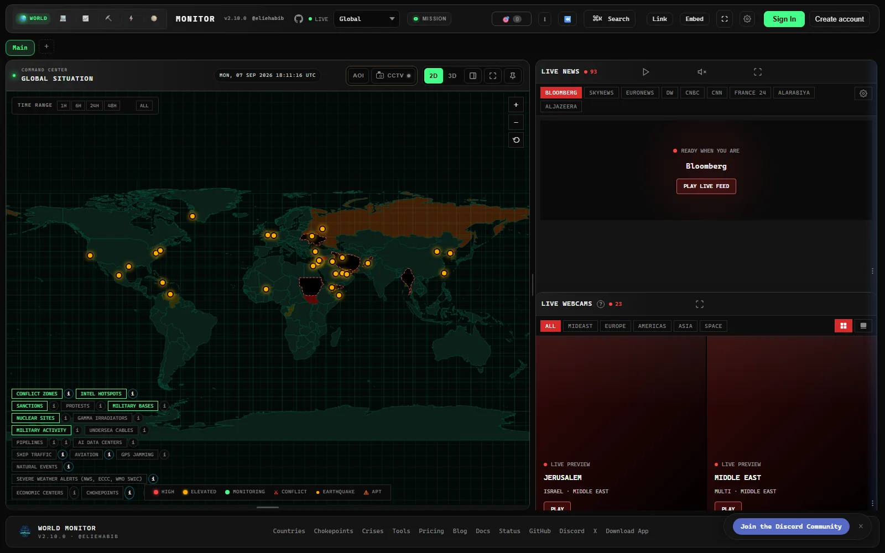
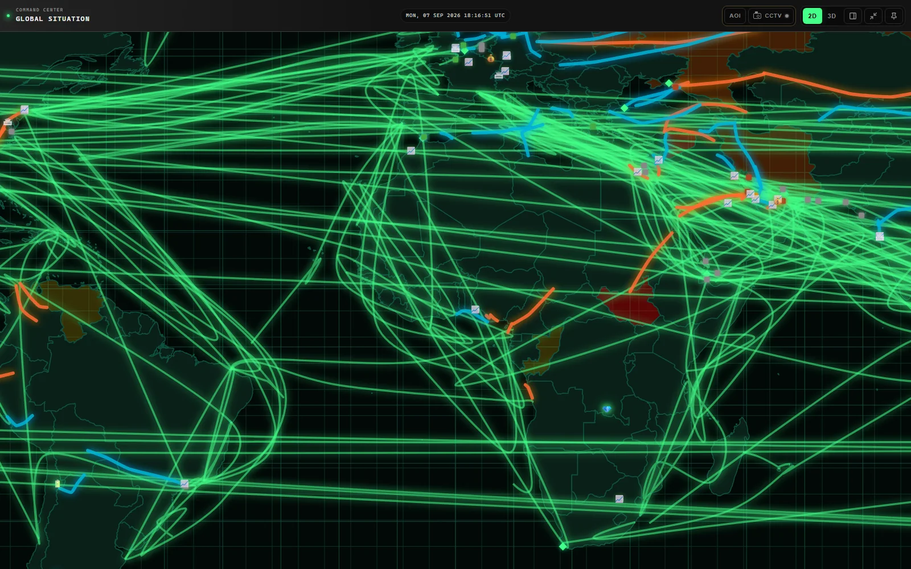
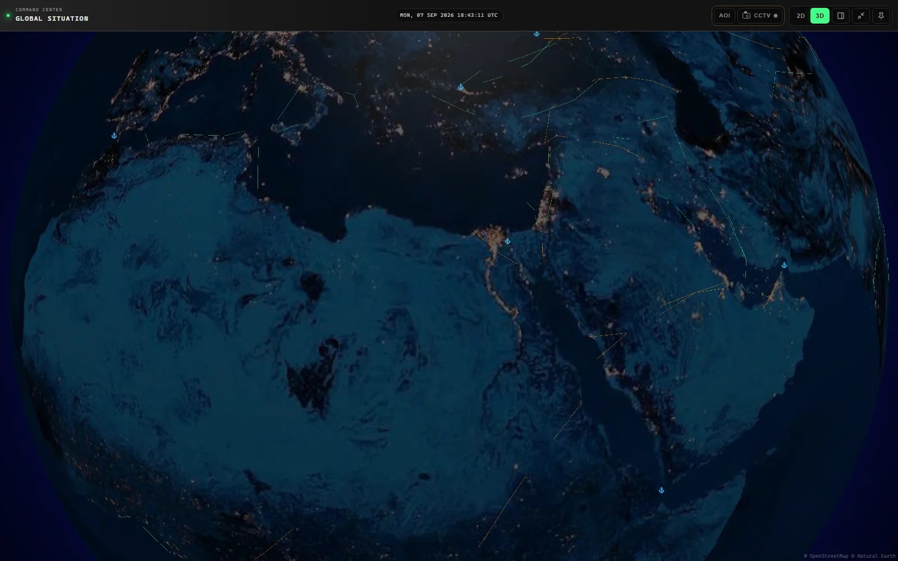
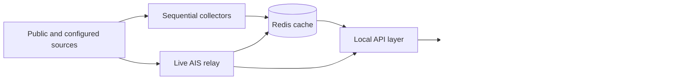

<p align="center">
  <sub>DETINA TRAN / INDEPENDENT OPEN INTELLIGENCE</sub>
</p>

<h1 align="center">OSIRIS</h1>

<p align="center">
  <strong>A self-hosted global intelligence command center.</strong><br>
  Connect geopolitical events, military movement, critical infrastructure,
  climate risk, aviation, maritime traffic, supply chains, and markets in one
  coherent operational picture.
</p>

<p align="center">
  Maintained by <a href="https://github.com/detinatran"><strong>Detina Tran</strong></a>
</p>

<p align="center">
  <a href="https://github.com/detinatran/dashboard/commits/main"></a>
  
  
  
  <a href="LICENSE"></a>
</p>

<p align="center">
  <a href="#the-mission"><strong>Overview</strong></a>
  &nbsp;&bull;&nbsp;
  <a href="#interface-showcase"><strong>Showcase</strong></a>
  &nbsp;&bull;&nbsp;
  <a href="#system-architecture"><strong>Architecture</strong></a>
  &nbsp;&bull;&nbsp;
  <a href="#run-it-locally"><strong>Run locally</strong></a>
  &nbsp;&bull;&nbsp;
  <a href="#make-it-yours"><strong>Make it yours</strong></a>
</p>

<p align="center">
  
</p>

> [!NOTE]
> OSIRIS is an independently maintained modified distribution based on
> [World Monitor](https://github.com/koala73/worldmonitor), originally created
> by Elie Habib. It is not affiliated with or endorsed by the upstream project.

## The Mission

Most monitoring tools expose one stream at a time. OSIRIS is designed around a
harder question: **what changes when several independent signals begin to agree?**

The dashboard places events, movement, infrastructure, environmental hazards,
public alerts, and market context on the same surface. It helps an operator move
from scattered feeds to a source-aware view of the event, its transmission path,
and the evidence that still needs verification.

### Three operating principles

- **See the system, not one feed.** Correlate physical, geopolitical, economic,
  and environmental signals without losing their original sources.
- **Keep the local experience fast.** Serve expensive upstream data from Redis
  and refresh it through bounded background collectors.
- **Fail honestly.** Optional integrations stay dormant when credentials or
  licensing are unavailable instead of producing noisy errors or fake data.

## Interface Showcase

<p align="center">
  <a href="docs/images/showcase/world-command-center.webp">
    
  </a>
</p>

<p align="center">
  <strong>Global Command Center</strong><br>
  <em>One working surface for live events, critical infrastructure, public alerts, and open-source reporting.</em>
</p>

<details open>
<summary><strong>Explore two additional operational views</strong></summary>
<br>

<p align="center">
  <a href="docs/images/showcase/global-supply-chain.webp">
    
  </a>
</p>

<p align="center">
  <strong>Supply-Chain Visibility</strong><br>
  <em>Follow maritime corridors, strategic chokepoints, transport flows, and infrastructure exposure.</em>
</p>

<p align="center">
  <a href="docs/images/showcase/maritime-globe.webp">
    
  </a>
</p>

<p align="center">
  <strong>Immersive Maritime Globe</strong><br>
  <em>Move from a global overview to a focused geospatial investigation without leaving the dashboard.</em>
</p>

</details>

## Operational Coverage

| Intelligence plane | Representative signals | Local behavior |
| --- | --- | --- |
| Geopolitical | Conflicts, hotspots, sanctions, instability, regional reporting | Source-attributed and cache-aware |
| Movement | Military aircraft, AIS vessels, ports, routes, chokepoints | ADSB.lol-first aviation and relay-backed maritime data |
| Infrastructure | Subsea cables, pipelines, nuclear facilities, outages, data centers | Layered on the shared geospatial surface |
| Environment | Weather, fires, earthquakes, GPS interference, provincial alerts | Keyless or public feeds where possible |
| Economic | Markets, commodities, energy, trade, supply-chain pressure | Combined with physical transmission paths |
| Analysis | Correlation, scenarios, briefs, and country intelligence | Premium RPCs run only with valid credentials |

## What Makes This Edition Different

- Complete Docker-first deployment with the frontend, API handlers, Redis,
  Redis REST, AIS relay, and cache scheduler in one stack.
- Sequential background collectors instead of dozens of browser-time requests.
- A cache-first default profile for GPSJam, Canadian alerts, forecasts,
  sanctions, PortWatch, Hormuz tracking, and military flights.
- Weather and PizzINT refresh owned by the relay, avoiding duplicate jobs.
- X, Telegram, and Pro AI disabled until their credentials are deliberately
  configured.
- ADSB.lol as the primary military source; automated OpenSky fallback remains
  off unless the operator has confirmed the appropriate licence.
- Repeatable production QA across real APIs and desktop/mobile interface flows.

## System Architecture



| Service | Responsibility |
| --- | --- |
| `worldmonitor` | Static application, local API handlers, and reverse proxy |
| `redis` | Persistent last-good data cache |
| `redis-rest` | Restricted Upstash-compatible Redis boundary |
| `ais-relay` | Live maritime relay plus Weather and PizzINT refresh |
| `local-seed-scheduler` | Sequential, bounded refresh of curated public data |

The scheduler runs one child process at a time and defaults to a `0.50` CPU
limit with `384 MB` of memory. Opening the dashboard reads warm local caches
instead of launching a new crawler fan-out.

## Run It Locally

### Fast interface development

```bash
git clone https://github.com/detinatran/dashboard.git
cd dashboard
npm install
npm run dev
```

Open [http://127.0.0.1:3000](http://127.0.0.1:3000). The core interface starts
without provider keys; credential-backed features remain unavailable until they
are configured.

### Complete local system

1. Copy `.env.example` to `.env`.
2. Generate `RELAY_SHARED_SECRET`, `REDIS_PASSWORD`, `REDIS_TOKEN`, and
   `WM_SESSION_SECRET` as independent random secrets.
3. Start the production-style stack.

```bash
docker compose up -d --build
docker compose ps
```

The complete setup, secret-generation commands, health checks, backup notes,
and provider options are documented in [SELF_HOSTING.md](SELF_HOSTING.md).

### Default provider policy

| Profile | Integrations |
| --- | --- |
| Ready in the curated local stack | GPSJam, Weather, Canadian alerts, Sanctions, Forecasts, Military Flights, PortWatch, Hormuz tracker, PizzINT |
| Optional after configuration | X intelligence, Telegram intelligence, Pro AI, provider-specific enrichments |
| Disabled by default | Automated OpenSky fallback, non-commercial ADS-B gap fill, browser-time bulk crawling |

## Verified Quality

Application baseline verified on commit
[`e6fba9f9c`](https://github.com/detinatran/dashboard/commit/e6fba9f9cfb115f0bc58efcad6b636c45755d335)
against the production-style local Docker stack:

| Verification gate | Result |
| --- | ---: |
| Production API checks | 9 / 9 passed |
| Desktop and mobile acceptance flows | 30 / 30 passed |
| DOM tests | 547 / 547 passed |
| Sidecar tests | 401 / 401 passed |
| Page errors | 0 |
| Console errors | 0 |
| Same-origin HTTP and request failures | 0 |

The test profile is reproducible with the repository QA runner and does not
include local screenshots, reports, secrets, or generated test artifacts in Git.

## Make It Yours

The README now uses a distinct repository identity, but a complete product
rebrand should be deliberate. Use this checklist when changing **OSIRIS** to
your final project name.

| Surface | Update here |
| --- | --- |
| Repository title, story, badges, and screenshots | `README.md` and `docs/images/showcase/` |
| Browser title, SEO, Open Graph, and structured metadata | `index.html` |
| Dashboard wordmark and footer | `src/app/panel-layout.ts` and locale files under `src/locales/` |
| Web favicon and social artwork | `public/favico/` |
| Desktop product name, identifier, descriptions, and icons | `src-tauri/tauri.conf.json` and `src-tauri/icons/` |
| Visual palette and variant theme | `src/styles/` and `src/bootstrap/variant-theme.ts` |
| Deployment domains and provider configuration | `.env`, `docker-compose.yml`, and deployment settings |

Find every remaining product-name reference before shipping a full rebrand:

```bash
rg -n "World Monitor|worldmonitor" index.html src src-tauri public
```

### Rename the GitHub repository

1. Open **Repository Settings > General > Repository name** on GitHub.
2. Set your own description, website, and topics in the repository **About** box.
3. Upload the prepared
   [OSIRIS social preview](docs/images/brand/osiris-social-preview.jpg) under
   **Settings > General > Social preview**.
4. Update the local remote after renaming:

```bash
git remote set-url origin https://github.com/detinatran/YOUR-NEW-NAME.git
git remote -v
```

Do not replace upstream domains with your own until the corresponding API,
documentation, and authentication endpoints actually exist. Keep the upstream
credit and licence notices when publishing a modified distribution.

## Project Structure

```text
src/                         Browser application and intelligence UI
server/ and api/             API handlers and service boundaries
scripts/                     Collectors, seeders, QA, and build tooling
shared/                      Shared contracts and source metadata
src-tauri/                   Native desktop shell and local sidecar
docs/                        Architecture, operations, and attribution
docker-compose.yml           Complete local service topology
SELF_HOSTING.md              Production-style self-hosting guide
```

## Development

```bash
npm run typecheck:all
npm run lint
npm run lint:boundaries
npm run test:dom
npm run test:sidecar
```

Contributions and focused improvements are welcome. Read
[CONTRIBUTING.md](CONTRIBUTING.md), open an issue in
[detinatran/dashboard](https://github.com/detinatran/dashboard/issues), and keep
new data sources explicit about provenance, cadence, and licensing.

## Security and Responsible Use

OSIRIS is an open-source situational-awareness interface, not a classified
intelligence system, trading venue, or substitute for professional judgement.
Correlation is not proof of causation. Verify consequential decisions against
the cited primary sources and current operating conditions.

Report vulnerabilities according to [SECURITY.md](SECURITY.md). Never commit
provider keys, local `.env` files, session secrets, Redis credentials, or raw QA
captures.

## Attribution and License

OSIRIS is an independently maintained modified distribution based on
[World Monitor](https://github.com/koala73/worldmonitor), originally created by
[Elie Habib](https://github.com/koala73).

- Original work: Copyright (C) 2024-2026 Elie Habib.
- Repository maintenance and modifications: Detina Tran and contributors.
- Source code licence: [AGPL-3.0-only](LICENSE).
- Third-party notices: [THIRD_PARTY_NOTICES.md](THIRD_PARTY_NOTICES.md).
- Trademark guidance: [docs/trademark-policy.mdx](docs/trademark-policy.mdx).
- Source catalogue: [docs/source-attribution.mdx](docs/source-attribution.mdx).

This repository is not affiliated with or endorsed by the upstream project.
Names, logos, data, and third-party services remain the property of their
respective owners.

<p align="center">
  <strong>OSIRIS</strong><br>
  <sub>Observe globally. Verify locally. Decide with context.</sub>
</p>
